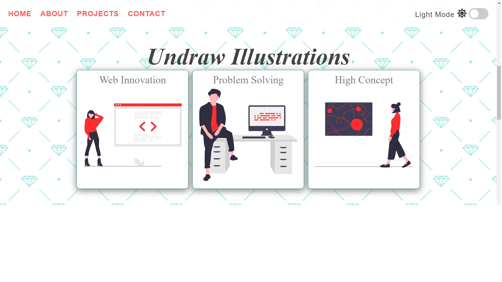

## Turn Off the light (Pure HTML/CSS, JS)

This is a little app to click on the button and Dark/light mode, change with variable CSS styles and event listeners
With Mobile adaptation

Go to WEBSITE of Turn Off the light [https://turn-off-the-light-d90ff.web.app/](https://turn-off-the-light-d90ff.web.app/)  

